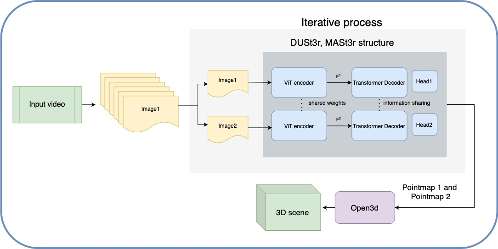
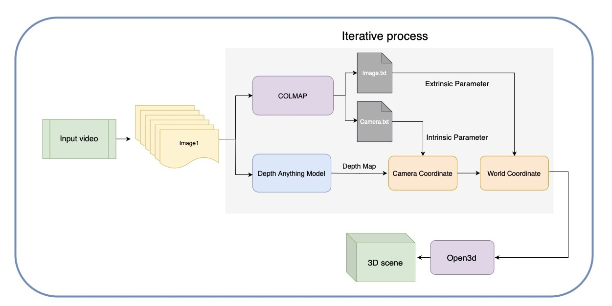

# 3D-reconstruction-from-image-with-Depth-Estimation-Model
## Introduction
Depth estimation has long been essential in computer vision. Traditional 3D reconstruction pipelines, whether using multiple or single views, involve multiple steps where tasks operate independently, limiting information flow and mutual support. Depth sensors are also prone to issues with object material and reflectivity, causing missing data in areas like reflective surfaces.

Recently, deep learning has simplified depth estimation from images, as explored in works such as  "Repurposing Diffusion-Based Image Gen- erators for Monocular Depth Estimation","DUStR: Geometric 3D Vision Made Easy", "Grounding Image Matching in 3D with MASt3R" , "Depth Anything: Unleashing the Power of Large- Scale Unlabeled Data" and "Depth Anything v2". These models enable depth prediction from a single image, eliminating the need for camera parameters.

My research adapts these models for video sequences to reconstruct 3D scenes by integrating predicted depth with camera parameters. This approach aims to streamline traditional pipelines, achieving similar precision through deep learning.
## Method

## Conclusion and Future work
Based on the previous results, MASt3R significantly outperforms DUStR, and it was observed that Depth Anything’s multi-frame performance yielded less accurate results than single-frame test- ing. However, the requirements for video footage differ among the methods: while MASt3R and DUStR need camera position shifts between frames, Depth Anything only requires changes in view- point from a fixed position.
Here are some tasks that I believe can be improved in the future, building upon the current tests:
• Systematic Testing: Collect a more structured test dataset and develop a robust evaluation system for comprehensive assess- ment. This would go beyond visual inspection to determine if the reconstructed scenes match real-world scales accurately, provid- ing a more objective and quantitative basis for evaluation.
• Establish a Complete Pipeline or User Interface: Develop a comprehensive usage pipeline. After applying the model to in- put videos, also use COLMAP to obtain the scene’s intrinsic and extrinsic parameters for reconstruction. This way, a 3D point cloud can be generated in Open3D, enabling users to complete the modeling process without switching programs.
• Fine-TunetheModel: Experiment with fine-tuning the model to minimize reconstruction errors and achieve more precise modeling.

## Reference
- Yang, L., Kang, B., Huang, Z., Zhao, Z., Xu, X., Feng, J., Zhao, H. "Depth Anything V2." *arXiv preprint arXiv:2406.09414*, 2024.
- Yang, L., Kang, B., Huang, Z., Xu, X., Feng, J., Zhao, H. "Depth Anything: Unleashing the Power of Large-Scale Unlabeled Data." *CVPR*, 2024.
- Leroy, V., Cabon, Y., Revaud, J. "Grounding Image Matching in 3D with MASt3R." *arXiv preprint arXiv:2406.09756*, 2024.
- Wang, S., Leroy, V., Cabon, Y., Chidlovskii, B., Revaud, J. "DUSt3R: Geometric 3D Vision Made Easy." *CVPR*, 2024.
- Ke, B., Obukhov, A., Huang, S., Metzger, N., Daudt, R. C., Schindler, K. "Repurposing Diffusion-Based Image Generators for Monocular Depth Estimation." *Proceedings of the IEEE/CVF Conference on Computer Vision and Pattern Recognition (CVPR)*, 2024.
